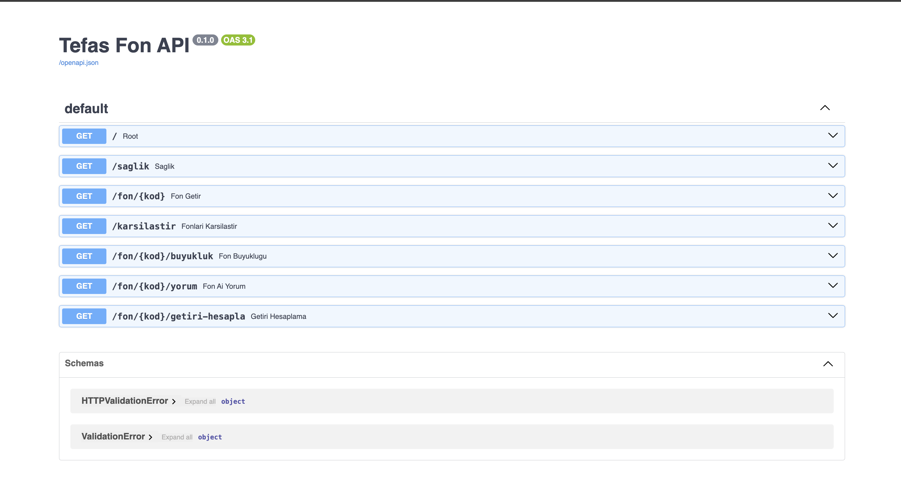
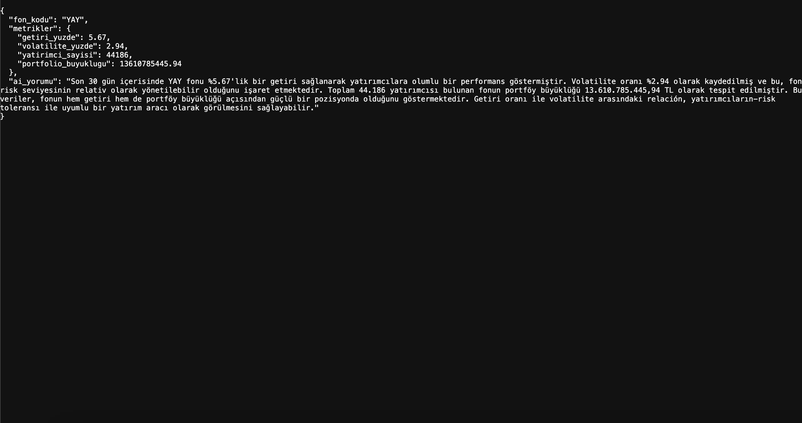
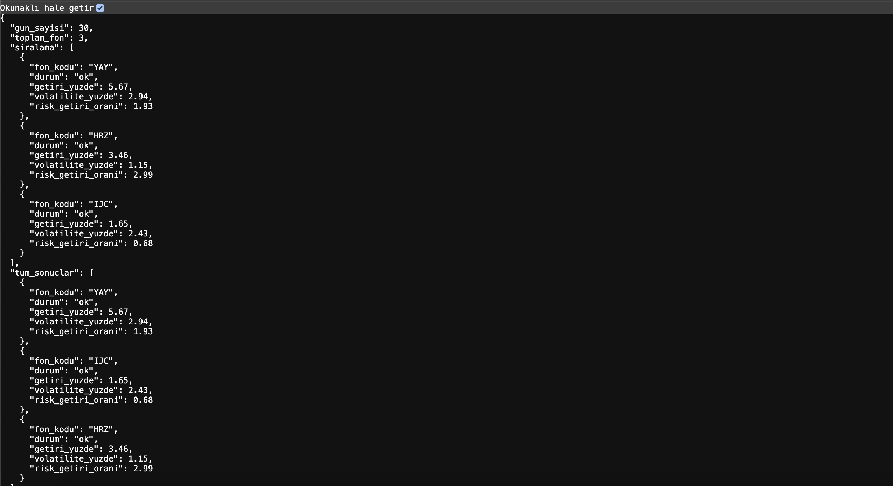
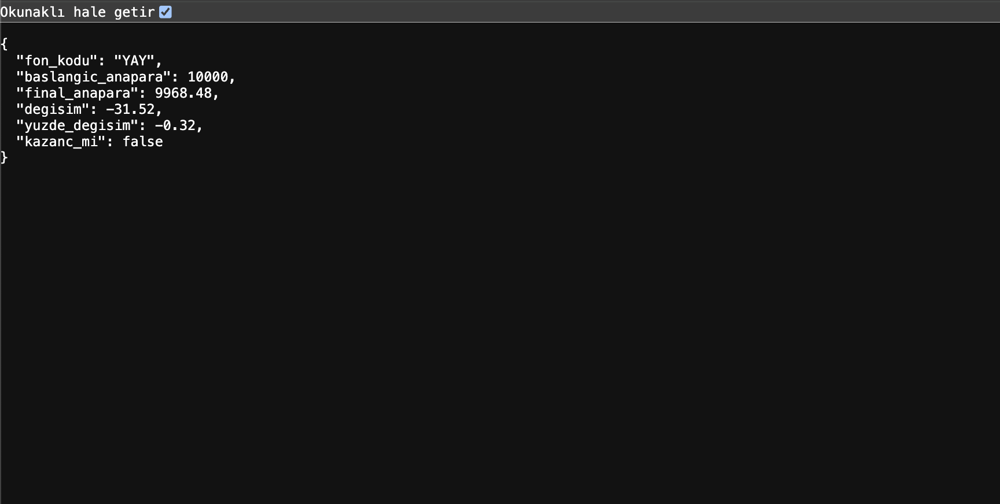

#  Tefas Fon Analiz API

Türkiye yatırım fonları için AI destekli analiz REST API'si.

##  Özellikler

- **REST API** — FastAPI ile 7 endpoint
- **AI Yorum** — Groq + Llama 3.3 ile fon performans analizi
- **Cache Layer** — SQLite ile 300x hızlanma
- **Finansal Hesaplama** — Getiri, volatilite, anapara dönüşümü
- **Çoklu Karşılaştırma** — Birden fazla fon kıyaslama

## Mimari
```mermaid
graph TD
    Kullanici[Kullanıcı] --> FastAPI[FastAPI Backend]
    FastAPI <--> SQLite[(SQLite Cache)]
    FastAPI --> Tefas[Tefas API]
    Tefas --> SQLite
    FastAPI --> Groq[Groq LLM API]
``` text

## 🛠️ Tech Stack

- **Backend**: Python, FastAPI, Uvicorn
- **Database**: SQLite
- **LLM**: Groq (Llama 3.3 70B)
- **Data**: Pandas, pytefas
- **Hosting**: (yakında)

## 📦 Endpoints

| Method | Endpoint | Açıklama |
|--------|----------|----------|
| GET | `/saglik` | Health check |
| GET | `/fon/{kod}` | Fon detayı |
| GET | `/fon/{kod}/getiri` | Getiri + volatilite |
| GET | `/fon/{kod}/buyukluk` | Portföy büyüklüğü |
| GET | `/fon/{kod}/getiri-hesapla?anapara=X` | Anapara değişim hesabı |
| GET | `/fon/{kod}/yorum` | AI destekli yorum |
| GET | `/karsilastir?kodlar=A,B,C` | Çoklu karşılaştırma |

## 🚀 Kurulum

### 1. Repo'yu klonla

```bash
git clone https://github.com/bilgili20/tefas-fon-api
cd tefas-api
```

### 2. Virtual environment oluştur

```bash
python -m venv venv
source venv/bin/activate  # Mac/Linux
# veya
venv\Scripts\activate     # Windows
```

### 3. Bağımlılıkları kur

```bash
pip install -r requirements.txt
```

### 4. `.env` dosyası oluştur

```bash
echo "GROQ_API_KEY=your_groq_api_key_here" > .env
```

Groq API key'ini buradan al: https://console.groq.com/keys

### 5. Çalıştır

```bash
python -m uvicorn main:app --reload
```

API hazır: `http://localhost:8000`  
Swagger UI: `http://localhost:8000/docs`

## 📊 Örnek Kullanım

```bash
# Fon detayı
curl http://localhost:8000/fon/YAY?gun=30

# AI yorumu
curl http://localhost:8000/fon/YAY/yorum

# Anapara hesabı  
curl "http://localhost:8000/fon/YAY/getiri-hesapla?anapara=10000&gun=30"
```

## 🧠 Öne Çıkan Kararlar

- **SQLite Cache**: Tefas dakikada 6 istek limiti koyuyor, cache ile bu limit aşılıyor
- **Hibrit AI**: Metrikleri deterministik hesaplayıp LLM'e yorumlatıyorum — halüsinasyon yok
- **Separation of Concerns**: API, database, business logic ayrı katmanlarda


## 📄 Lisans

MIT

## 📸 Görsel Önizleme

### Swagger UI - Otomatik Dokümantasyon


### AI Destekli Yorum Endpoint'i


### Çoklu Fon Karşılaştırma


### Getiri Hesaplama

